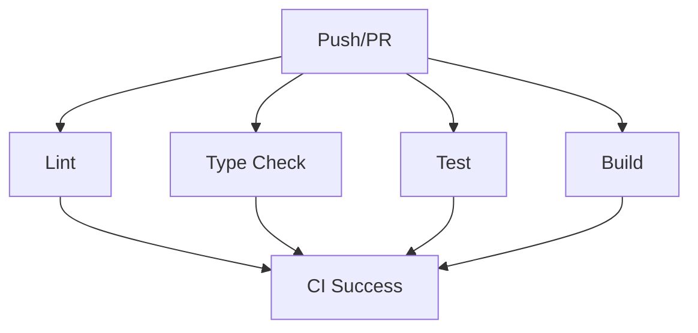

# CI/CD Overview - MCQuest Designer

This document provides a comprehensive overview of the continuous integration and deployment strategy for MCQuest Designer.

## Architecture

### Monorepo Structure

```
mcquest_designer/
├── apps/
│   └── web/              # Next.js application
├── packages/
│   ├── schema/           # Shared Zod schemas
│   └── export/           # SNBT compiler and exporter
└── .github/
    └── workflows/
        └── ci.yml        # CI pipeline
```

### Pipeline Philosophy

1. **Fast Feedback** - Parallel job execution for rapid results
2. **Fail Fast** - Early detection of issues (lint → typecheck → test → build)
3. **Comprehensive Validation** - Multiple quality gates before merge
4. **Automated Testing** - No manual intervention required
5. **Reproducible Builds** - Frozen lockfile ensures consistency

## CI Workflow

### Trigger Strategy

**Push Triggers:**
- `main` - Production branch
- `develop` - Integration branch
- `feature/*` - Feature branches
- `release/*` - Release preparation
- `hotfix/*` - Emergency fixes

**Pull Request Triggers:**
- Target: `main` or `develop`
- Ensures all changes are validated before merge

### Job Matrix



### Job Details

#### 1. Lint Job
**Purpose:** Code quality and style enforcement

**Steps:**
- Install dependencies with pnpm
- Run ESLint across all workspaces
- Validate Prettier formatting

**Success Criteria:**
- No ESLint errors or warnings
- All files properly formatted

**Failure Examples:**
- Unused variables
- Missing type annotations
- Inconsistent formatting

---

#### 2. Type Check Job
**Purpose:** TypeScript type safety validation

**Steps:**
- Install dependencies
- Run `tsc --noEmit` in all packages
- Validate type consistency across monorepo

**Success Criteria:**
- No TypeScript errors
- All types properly defined
- Cross-package type consistency

**Failure Examples:**
- Type mismatches
- Missing type definitions
- Circular dependencies

---

#### 3. Test Job
**Purpose:** Execute test suite and generate coverage

**Steps:**
- Install dependencies
- Run Vitest tests
- Upload coverage reports as artifacts

**Success Criteria:**
- All tests pass
- No test timeouts
- Coverage meets thresholds (if configured)

**Failure Examples:**
- Failed test assertions
- Uncaught errors in tests
- Golden export mismatches

**Artifacts:**
- Coverage reports (7-day retention)
- Test results JSON

---

#### 4. Build Job
**Purpose:** Validate buildability of all packages

**Steps:**
- Install dependencies
- Build TypeScript packages (`schema`, `export`)
- Build Next.js web application
- Cache outputs for reuse

**Success Criteria:**
- All packages build successfully
- No build errors or warnings
- Output artifacts generated

**Environment Variables:**
- `NEXT_TELEMETRY_DISABLED=1` - Disable Next.js telemetry
- `NEXT_PUBLIC_CLERK_PUBLISHABLE_KEY` - Clerk public key (or placeholder)
- `CLERK_SECRET_KEY` - Clerk secret key (or placeholder)

**Failure Examples:**
- Missing dependencies
- Import errors
- Next.js configuration issues

**Cache Strategy:**
- Cache `.turbo` directory (Turbo outputs)
- Cache `.next` directory (Next.js build)
- Cache `packages/*/dist` (TypeScript builds)

---

#### 5. CI Success Job
**Purpose:** Single status check for branch protection

**Behavior:**
- Runs after all other jobs complete
- Fails if any dependent job fails
- Provides unified pass/fail status

**Usage:**
- Configure branch protection to require "CI Success" check
- Prevents merging PRs with failed CI

## Performance Optimizations

### 1. Parallel Execution

All jobs run in parallel by default:
- **No dependencies between jobs** - Maximum parallelization
- **Estimated time savings:** 60-70% vs sequential execution
- **Example:** 10-minute sequential → 3-minute parallel

### 2. Turbo Caching

Turbo automatically caches task outputs:
- **Cache location:** `.turbo` directory
- **Cache key:** Content hash of inputs
- **Behavior:** Skips tasks with unchanged inputs
- **Impact:** 2-5x faster builds on cached runs

### 3. pnpm Caching

GitHub Actions caches pnpm store:
- **Cache key:** `pnpm-lock.yaml` hash
- **Cache location:** `~/.pnpm-store`
- **Impact:** 80% faster dependency installation

### 4. Concurrency Control

Automatic cancellation of superseded workflows:
- **Group:** `${{ github.workflow }}-${{ github.ref }}`
- **Strategy:** Cancel in-progress workflows on new push
- **Benefit:** Saves compute resources and queue time

## Environment Configuration

### Required Secrets

Configure in GitHub repository settings (`Settings → Secrets and variables → Actions`):

| Secret | Purpose | Required For |
|--------|---------|--------------|
| `NEXT_PUBLIC_CLERK_PUBLISHABLE_KEY` | Clerk authentication (public) | Production builds |
| `CLERK_SECRET_KEY` | Clerk authentication (server) | Production builds |

**Note:** CI uses placeholder values if secrets are missing, allowing fork/development builds to succeed.

### Optional Secrets

For future enhancements:

| Secret | Purpose |
|--------|---------|
| `VERCEL_TOKEN` | Deploy previews |
| `CODECOV_TOKEN` | Coverage reporting |
| `SONAR_TOKEN` | Code quality analysis |

## Branch Protection

### Recommended Rules

**For `main` branch:**
- ✅ Require status checks: `CI Success`
- ✅ Require branches to be up to date
- ✅ Require pull request reviews (1+ approvers)
- ✅ Dismiss stale reviews on new commits
- ✅ Require conversation resolution
- ✅ Require signed commits (optional)
- ❌ Allow force pushes (never on main)

**For `develop` branch:**
- ✅ Require status checks: `CI Success`
- ✅ Require branches to be up to date
- ✅ Require pull request reviews (1+ approvers)
- ✅ Allow force pushes (with restrictions)

## Monitoring and Debugging

### Viewing Workflow Results

1. Navigate to repository **Actions** tab
2. Select **CI** workflow from left sidebar
3. Click specific run to view job details
4. Expand job steps to see detailed logs

### Common Failures

#### Lint Failures
```
Error: ESLint found 3 errors and 0 warnings
  src/components/QuestNode.tsx:45:10 - Unexpected console statement (no-console)
```

**Fix:** Address linting errors or update ESLint configuration

---

#### Type Check Failures
```
Error: TS2322: Type 'string | undefined' is not assignable to type 'string'.
  apps/web/src/lib/auth.ts:12:5
```

**Fix:** Add proper type guards or update type definitions

---

#### Test Failures
```
FAIL packages/export/src/__tests__/compiler.test.ts
  ✕ should generate deterministic quest IDs (45ms)
    Expected: "quest-001"
    Received: "quest-002"
```

**Fix:** Investigate test logic or implementation bug

---

#### Build Failures
```
Error: Missing required environment variable: NEXT_PUBLIC_CLERK_PUBLISHABLE_KEY
```

**Fix:** Add secret to GitHub repository settings or use placeholder

### Performance Issues

#### Slow Dependency Installation

**Symptoms:**
- `pnpm install` takes >2 minutes
- No cache hit in logs

**Solutions:**
1. Check pnpm cache status in workflow logs
2. Verify `pnpm-lock.yaml` is committed
3. Force cache reset (delete and re-run)

---

#### Slow Builds

**Symptoms:**
- Build job takes >5 minutes
- Turbo reports no cache hits

**Solutions:**
1. Check Turbo cache configuration in `turbo.json`
2. Verify `.turbo` directory is cached
3. Review build task dependencies

---

#### Queue Time

**Symptoms:**
- Workflow queued for extended period
- Multiple workflows running simultaneously

**Solutions:**
1. Verify concurrency settings are correct
2. Check GitHub Actions minute quota
3. Consider upgrading GitHub plan

## Local Development

### Pre-Push Validation

Run the same checks locally before pushing:

```bash
# Full CI validation (sequential)
pnpm lint
pnpm typecheck
pnpm test
pnpm build

# Fast validation (parallel)
pnpm lint & pnpm typecheck & pnpm test & wait
```

### Fixing Common Issues

```bash
# Fix formatting issues
pnpm format

# Clear caches
pnpm clean
rm -rf node_modules .turbo
pnpm install

# Reset to clean state
git clean -fdx
pnpm install
```

## Future Enhancements

### Planned Improvements

1. **E2E Testing**
   - Add Playwright tests for critical user flows
   - Run on PRs targeting main
   - Visual regression testing

2. **Security Scanning**
   - Dependency vulnerability scanning (npm audit, Snyk)
   - Container security scanning (Trivy)
   - Secret scanning (GitLeaks)

3. **Performance Budgets**
   - Track Next.js bundle size
   - Fail builds exceeding size thresholds
   - Lighthouse CI for performance metrics

4. **Deploy Previews**
   - Auto-deploy PR previews to Vercel
   - Comment preview URLs on PRs
   - Automatic cleanup on PR close

5. **Code Coverage**
   - Enforce minimum coverage thresholds
   - Upload coverage to Codecov/Coveralls
   - Display coverage badges in README

6. **Code Quality**
   - Integrate SonarCloud for code quality metrics
   - Track technical debt
   - Enforce quality gates

## Best Practices

### 1. Commit Frequently

Small, focused commits enable:
- Faster CI runs (less to validate)
- Easier debugging (smaller diffs)
- Better cache utilization (fewer changes)

### 2. Keep Dependencies Updated

- Enable Dependabot (already configured)
- Review and merge dependency updates weekly
- Test thoroughly after major version updates

### 3. Monitor CI Performance

- Track average CI run time
- Identify slow jobs for optimization
- Monitor cache hit rates

### 4. Use Draft PRs

- Open PRs as drafts for work-in-progress
- CI still runs but doesn't block other PRs
- Mark "Ready for review" when complete

### 5. Fix Broken Builds Immediately

- Don't push more commits on broken CI
- Fix or revert the breaking change
- Unblocks other developers

## Troubleshooting

### CI Passes Locally but Fails in GitHub Actions

**Possible Causes:**
1. **Node/pnpm version mismatch** - Check `package.json` engines
2. **Missing environment variables** - Add to GitHub secrets
3. **File case sensitivity** - CI runs on Linux (case-sensitive)
4. **Timezone differences** - Use UTC in tests
5. **Cache staleness** - Clear cache and re-run

### CI Fails Locally but Passes in GitHub Actions

**Possible Causes:**
1. **Uncommitted changes** - Ensure all files are committed
2. **Local cache corruption** - Run `pnpm clean` and reinstall
3. **Environment-specific config** - Check `.env.local` files

### Workflow Not Triggering

**Possible Causes:**
1. **Branch name mismatch** - Check trigger patterns
2. **Workflow file syntax error** - Validate YAML
3. **GitHub Actions disabled** - Check repository settings

## References

- [GitHub Actions Documentation](https://docs.github.com/en/actions)
- [pnpm Documentation](https://pnpm.io/)
- [Turbo Documentation](https://turbo.build/repo/docs)
- [Next.js CI/CD Best Practices](https://nextjs.org/docs/pages/building-your-application/deploying/ci-build-caching)
